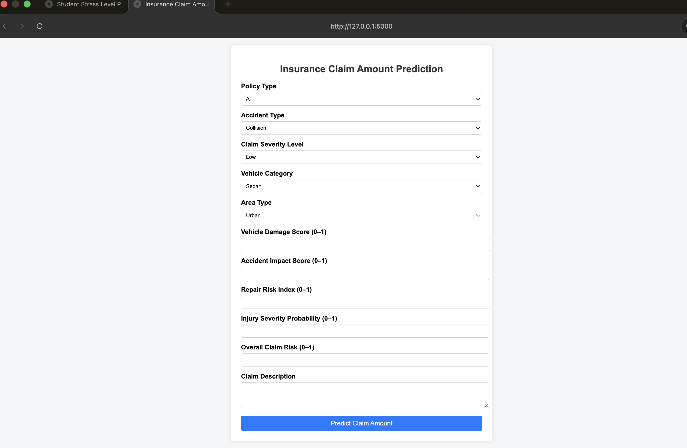
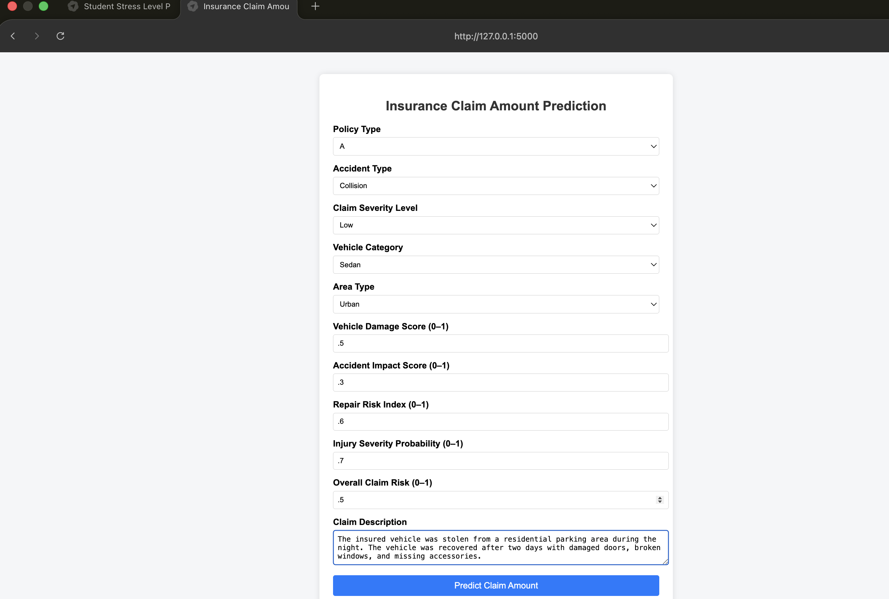
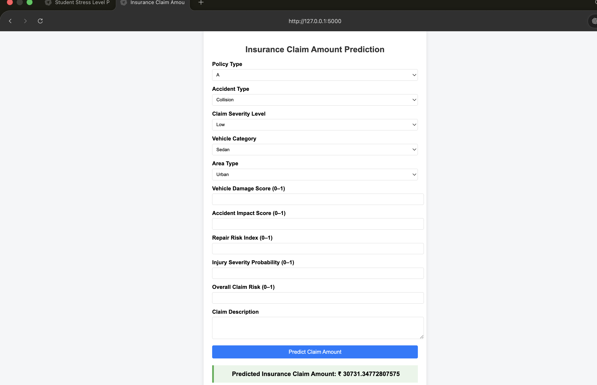

<p align="center">
  
</p>

<h1 align="center"> Insurance Claim Amount Prediction</h1>

<p align="center">
An End-to-End Machine Learning Regression Project for Predicting Insurance Claim Amounts
</p>

<p align="center">
  
  
  
  
</p>

---

#  Project Overview

The **Insurance Claim Amount Prediction** project is an end-to-end Machine Learning regression application that estimates the insurance claim amount based on policy details, accident information, vehicle damage, and textual claim descriptions.

The project demonstrates the complete Machine Learning workflow, including **data preprocessing**, **feature engineering**, **text processing**, **model training**, **model evaluation**, and **deployment** using a Flask web application.

---

#  Features

- End-to-End Machine Learning Pipeline
- Data Cleaning & Preprocessing
- Feature Engineering
- Text Feature Processing
- Lasso Regression Model
- Flask-based Web Application
- Interactive Prediction Interface

---

#  Machine Learning Model

### Algorithm Used

- **Lasso Regression**

###  Model Performance

| Metric | Training | Testing |
|---------|----------|----------|
| RMSE | **1880.98** | **1864.05** |
| MAE | **1427.66** | **1397.13** |
| R² Score | **0.9730** | **0.9749** |

---

#  Features Used

- Policy Type
- Accident Type
- Claim Severity Level
- Vehicle Category
- Area Type
- Vehicle Damage Score
- Accident Impact Score
- Repair Risk Index
- Injury Severity Probability
- Overall Claim Risk
- Claim Description (Text Feature)

###  Target Variable

- Insurance Claim Amount (Continuous Value)

---

#  Tech Stack

- Python
- Scikit-learn
- Flask
- Pandas
- NumPy
- Matplotlib

---

#  Project Structure

```text
insurance-claim-amount-prediction/
│
├── images/
│   ├── banner.png
│   ├── home.png
│   ├── prediction.png
│   └── result.png
│
├── templates/
├── app.py
├── regmodel.pkl
├── requirements.txt
├── insurance.ipynb
├── insurance_claim_dataset.csv
└── README.md
```

---

# Application Preview

##  Home Page

<p align="center">
  
</p>

---

##  Prediction Page

<p align="center">
  
</p>

---

## Prediction Result

<p align="center">
  
</p>

---

#  Installation

### Clone the repository

```bash
git clone https://github.com/harsh8303/insurance-claim-amount-prediction.git
```

### Move to the project directory

```bash
cd insurance-claim-amount-prediction
```

### Install dependencies

```bash
pip install -r requirements.txt
```

### Train the model

Run:

```bash
insurance.ipynb
```

### Run the Flask application

```bash
python app.py
```

### Open your browser

```text
http://127.0.0.1:5000
```

---

#  Future Improvements

- Improve prediction performance using advanced regression algorithms.
- Hyperparameter optimization.
- Deploy the application on Render or Railway.
- Improve NLP processing for claim descriptions.
- Train on larger real-world insurance datasets.

---

#  Author

**Harshit Sahu**

- **GitHub:** https://github.com/harsh8303
- **LinkedIn:** https://www.linkedin.com/in/harshit-sahu-67119530a/

---

##  Support

If you found this project useful, consider giving it a  on GitHub.
